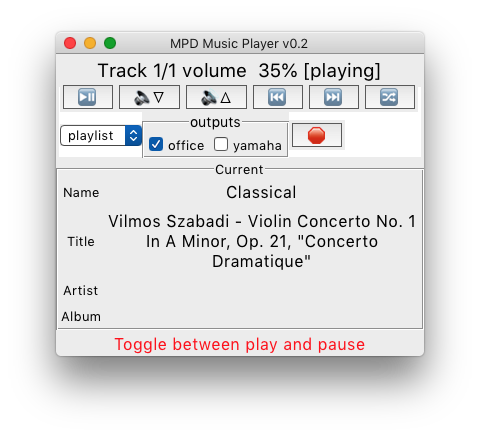

# MPD controller
Simple [mpd](https://www.musicpd.org/) music player
written in [Tcl/TK](https://www.tcl.tk/)
- Supports selecting and playing from existing playlists
- Fully asynchronous and resizeable

## Notes
- Tested on Mac/Linux/Android with tcl/tk8.6
- Single file version (constituent parts to come)
- This is my "backup" copy, in case I loose my local copy
- Change the *host* `in mpd_open` to point to your mpd daemon

## Sample screenshot

